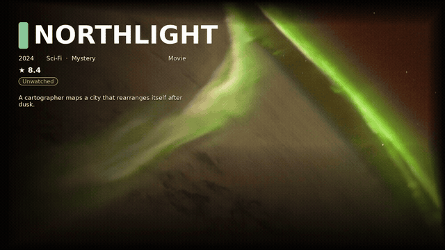

<p align="center">
  
</p>

<p align="center">
  <strong>Cinematic live wallpapers for Projectivy.</strong><br/>
  Stills and optional <em>parallax VIDEO</em> loops, generated from Jellyfin and Jellyseerr/Seerr,<br/>
  queued with taste, previewed as tonight's home screen, served to the TV.
</p>

<p align="center">
  <a href="https://github.com/iManunator/wallpaparr/actions/workflows/ci.yml"></a>
  <a href="https://github.com/iManunator/wallpaparr/actions/workflows/release.yml"></a>
  <a href="https://github.com/iManunator/wallpaparr/releases/latest"></a>
  <a href="https://github.com/iManunator/wallpaparr/pkgs/container/wallpaparr"></a>
  <a href="LICENSE"></a>
  
</p>

<p align="center">
  <a href="#downloads">Downloads</a> ·
  <a href="#get-it-running">Get it running</a> ·
  <a href="#connect-your-library-and-generate">Connect your library</a> ·
  <a href="#the-tv-plugin">TV plugin</a> ·
  <a href="docs/REFERENCE.md">Full reference</a> ·
  <a href="docs/INSTALL.md">Install details</a> ·
  <a href="CHANGELOG.md">Changelog</a>
</p>

**Wallpaparr** is an *arr-family* box that sits next to Jellyfin, baking cinematic live wallpapers for Projectivy.

---

## Tonight, on your home screen

<p align="center">
  
</p>

<p align="center">
  <em>An actual baked parallax loop (not a mockup) — Netflix Hero chrome over one of the license-safe demo stills. Same pipeline that runs against your own Jellyfin/Seerr library.</em>
</p>

Wallpaparr is a small self-hosted server plus a Projectivy plugin. The server pulls titles from your Jellyfin library and/or Jellyseerr, bakes each one into a cinematic 16:9 wallpaper (title, rating, watch status, optional parallax motion), and the plugin serves them to Projectivy on your TV.

| Page | What it's for |
| --- | --- |
| **Tonight** | The home page — a live preview of the exact wallpaper Projectivy will show next. |
| **Gallery** | Every generated wallpaper. Pin favorites, hide ones you never want, delete, or open full-screen. |
| **Editor** | Design the look: layout, fonts, colors, badges, motion — six presets to start from, or build your own. |
| **Generate** | Pull titles from Jellyfin/Jellyseerr and bake wallpapers for them, one batch at a time. |
| **Settings** | Connect Jellyfin/Jellyseerr, set the taste mix, motion defaults, and cron schedules. |
| **Dashboard** | At-a-glance health: gallery size, last cron run, provider status. |

---

## Downloads

| Get | Link |
| --- | --- |
| **Plugin APK (primary)** | [`wallpaparr-plugin-release.apk`](https://github.com/iManunator/wallpaparr/releases/latest/download/wallpaparr-plugin-release.apk) on the [latest GitHub Release](https://github.com/iManunator/wallpaparr/releases/latest) |
| **Container** | [`ghcr.io/imanunator/wallpaparr:latest`](https://github.com/iManunator/wallpaparr/pkgs/container/wallpaparr) |

```bash
docker pull ghcr.io/imanunator/wallpaparr:latest
adb install -r wallpaparr-plugin-release.apk
```

Older tagged versions, debug APKs, and CI artifact fallbacks: see [Downloads in the full reference](docs/REFERENCE.md) or [docs/RELEASE.md](docs/RELEASE.md).

---

## Get it running

```bash
mkdir -p data && cp -n config.example.json data/config.json || true
docker run --name wallpaparr --restart unless-stopped -d -p 8787:8787 \
  -e PUBLIC_BASE_URL=http://YOUR_LAN_IP:8787 \
  -v "$PWD/data:/data" \
  ghcr.io/imanunator/wallpaparr:latest
```

Open **http://127.0.0.1:8787** — Tonight is the home page. With nothing configured yet, it auto-seeds a demo catalog of license-safe cinematic stills so you can see it working immediately — no Jellyfin required for this step.

Prefer Docker Compose, want to build from source, or need to put the generated gallery on a different disk than the container? See **[docs/INSTALL.md](docs/INSTALL.md)**.

---

## Connect your library and generate

This is the part that turns the demo into *your* wallpapers.

1. Open **Settings** and fill in your **Jellyfin** URL + API key (and/or **Jellyseerr** URL + API key). Click **Test** next to each to confirm the connection.
2. Open **Generate**, set **Source** to `Jellyfin` (or `Jellyseerr`, or `All configured`), pick a **Layout**, and click **Run batch**. This pulls titles from your library and bakes a wallpaper for each one.
3. Check **Gallery** — your titles should now show up with real artwork, ratings, and watch status.
4. Optional: check **Bake parallax / motion VIDEO** before running the batch (or bake it later per-title) for looping motion wallpapers instead of static stills.
5. Optional: in **Settings → Cron / batch**, add a schedule so new/trending titles get generated automatically instead of running Generate by hand every time.

That's the whole loop: connect → generate → (optionally) schedule. Everything else in the app (Editor, taste mix, queues) shapes *how* those wallpapers look and get picked, not whether they exist.

---

## The TV plugin

1. Sideload [`wallpaparr-plugin-release.apk`](https://github.com/iManunator/wallpaparr/releases/latest/download/wallpaparr-plugin-release.apk).
2. Projectivy → Appearance → Wallpaper → **Wallpaparr**.
3. Server URL: `http://YOUR_LAN_IP:8787` (not `127.0.0.1` — the TV has to reach it over the network).
4. Pick mode **Tonight's mix**. Enable **Play baked motion (MP4)** if you baked any.

```bash
adb connect TV_IP
adb install -r wallpaparr-plugin-release.apk
```

Package `com.imanunator.wallpaparr` · full pick-mode/deep-link details in [docs/PROJECTIVY.md](docs/PROJECTIVY.md).

---

## Docs

| Doc | Contents |
| --- | --- |
| [Reference](docs/REFERENCE.md) | Full feature list, architecture diagram, API contract, Wallpaparr vs SeerChannel |
| [Install](docs/INSTALL.md) | Server setup (Docker/Compose), separate-disk storage, plugin, migration from tvbgsuite |
| [Release / GHCR / APK](docs/RELEASE.md) | How `:latest` publishes, how to tag a release, permissions |
| [Verify](docs/VERIFY.md) | Demo mode, no Jellyfin, no GHCR |
| [API](docs/API.md) | Status contract + editor/ops endpoints |
| [Motion](docs/MOTION.md) | IMAGE vs VIDEO, parallax bake, intensity |
| [Overlays](docs/OVERLAYS.md) | Clock / HA / news hooks |
| [Projectivy plugin](docs/PROJECTIVY.md) | Pick modes, UUID, deep links (Moonfin, SeerrTV, browser fallback), all supported player clients |
| [Changelog](CHANGELOG.md) | Full version history |

---

## Credits

- Projectivy wallpaper plugin contract: [spocky/projectivy-plugin-wallpaper-provider](https://github.com/spocky/projectivy-plugin-wallpaper-provider)
- Prior WebGUI work: [androidtvbackgroundWebGui](https://github.com/iManunator/androidtvbackgroundWebGui)

MIT © 2026 iManunator
