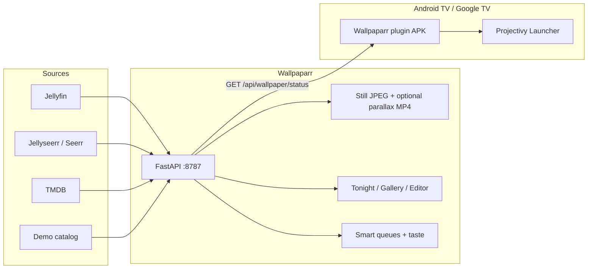

# Reference

Deeper technical detail moved out of the README: full feature list, architecture, API contract, and how Wallpaparr compares to SeerChannel. Start with the [README](../README.md) if you just want it running.

## Features

| Feature | What you get |
| --- | --- |
| **Tonight preview** | See tonight's pick inside Projectivy chrome before it hits the TV. Bake this pick, open the editor, or refresh the mix. |
| **Layout DNA** | Netflix Hero (gold), Prime Cinematic, Google TV Clean, **Projectivy Dock**, Status Focus, Jellyfin Dense — TV-safe chrome on all six (clock/dock margins, watch/Seerr on their own row, logo vs title). Every metadata chip (year, genres, runtime, media type, age, source) truncates or shrinks to fit its own slot — long real titles and genre names never overlap a neighbour. Custom layouts (`preset: false`) stay yours. |
| **Movie / Series badge** | `media_type` slot (Movie / Series) on all six bundled presets, and addable to any custom layout from the editor's layer picker. |
| **Smart queues** | Unwatched · Watched · **Partly watched** · Continue watching · Newly added · Seerr trending · Requestable · Pinned. Gallery badges match the queues. Series watch state is Jellyfin's aggregate `PlayedPercentage` across episodes, so a show with a few watched episodes reads as partly watched, not unwatched. Never repeats the wallpaper you were just shown back-to-back, unless the layout truly has only one background left. |
| **Parallax motion** | Optional H.264 loops: layered plate + locked chrome · parallax / Ken Burns / drift of the **artwork only** · Subtle / Balanced / Cinematic / Bold (background zoom/pan) · JPEG still always kept. `videoUrl` only when an MP4 exists. Fade-to-black at each clip's start/end (editable duration) masks Projectivy's hard player-swap cut between wallpapers; an experimental fly-in intro adds a fast zoom swoop that eases seamlessly into the normal drift. |
| **Seerr categories** | Trending, popular, or upcoming movies/series from Jellyseerr — not just trending — with an "upcoming" badge for titles that haven't released yet. |
| **OMDb enrichment** | Optional IMDb rating, Rotten Tomatoes, Metacritic, and awards on any title with a resolvable IMDb id — no separate TMDB key needed for Seerr-sourced logos, which now come from Jellyseerr's own per-item detail lookup. |
| **Taste profiles** | `tonight` · `unwatched_heavy` · `cinephile` · `discovery` — weighted mixes, editable, `profile=` / `pool=taste:<name>`. |
| **Plugin pick modes** | Tonight's mix, continue watching, newly added, Seerr trending, pinned, plus sort / pool / mix / round-robin from tvbgsuite. |
| **Demo mode** | Six fixture titles, no Jellyfin. `./scripts/verify.sh` builds the image, waits for health, curls status. |
| **Pin / never-show** | Hidden titles never enter `/api/wallpaper/status`. Pinned pool does not silently fall back. |
| **Overlays** | Off by default. Optional clock card + HA / news / JSON hooks. |
| **Jellyfin artwork** | Generate fetches Backdrop, then Primary. Clearlogos use Jellyfin **Logo** (or TMDB `logos` for Seerr). The editor previews the same art in-page via `/api/media/artwork/{id}` and `/api/media/logo/{id}`. |
| **Logo integration** | Layout `title_display`: `auto` (logo if fetched, else the name), `logo`, or `text`. Smart resize, contrast, and Projectivy safe-zone padding. Demo Northlight ships an original clearlogo PNG; other demo titles use text. |
| **Cron** | Multiple independent schedules, each with its own skip / replace / refresh-status / cleanup / ids / motion rules. Run now + toasts. |

## Architecture



| Piece | Path | Role |
| --- | --- | --- |
| Backend | `backend/` | Generate, catalog, queues, taste, cron, Projectivy HTTP API |
| Web UI | `web/` | Tonight preview, gallery, layout editor, generate, health, settings |
| Plugin | `plugin/` | Projectivy wallpaper provider `com.imanunator.wallpaparr` |
| Image | `Dockerfile` | `ghcr.io/imanunator/wallpaparr` — Python + ffmpeg + built UI |

## API contract

Compatible with the older TV Background Suite plugin (`imageUrl`, `actionUrl`, `path`; optional `mediaType` / `videoUrl`). Additive fields: `parallaxStyle`, `motionDuration`, `queue`, `pinned`, `watchState`. Full tables: **[docs/API.md](API.md)**.

| Method | Path | Purpose |
| --- | --- | --- |
| `GET` | `/api/health` | `{ ok, service: "wallpaparr", version }` |
| `GET` | `/api/wallpaper/status` | Next wallpaper. Query: `layout`, `sort`, `pool`, `queue`, `profile`, `exclude`, filters |
| `GET` | `/api/tonight` | Taste pick + queues + motion snapshot for the Tonight UI |
| `GET` | `/api/dashboard` | Gallery size, last cron/generate, providers |
| `GET` | `/api/gallery` | Catalog. `POST /api/gallery/{id}/flag` pins or hides; `DELETE /api/gallery/{id}` removes one still + MP4; `POST /api/gallery/delete-all` clears the library (skips pins unless `include_pins`) |
| `GET` | `/api/jobs/latest` | Latest generate / motion / cron job (`idle` if none) |
| `POST` | `/api/jobs` | Start a pollable generate / motion / cron job |
| `GET` | `/api/media` | Live provider preview (`source=jellyfin` / `demo` / `jellyseerr`) |
| `GET` | `/api/media/artwork/{id}` | Same-origin Jellyfin backdrop/poster proxy for the editor |
| `GET` | `/api/queues` | Smart-queue counts |
| `GET` | `/api/options` | Pick modes, pools, motion, taste, queues, clients |
| `POST` | `/api/generate` | Batch stills from provider artwork (+ optional VIDEO) |
| `POST` | `/api/wallpaper/generate-motion` | Bake MP4s for a layout (`path=` = one title) |
| `POST` | `/api/cron/run` | Run a cron-shaped batch now (toasts) |
| `GET`/`POST` | `/api/settings` | Providers, cron, motion, taste, overlays |

`GET /api/wallpaper/status?layout=Netflix%20Hero&profile=tonight` is the call the plugin makes for **Tonight's mix**.

<details>
<summary>Example status payload</summary>

```json
{
  "imageUrl": "http://host:8787/api/wallpaper/image/Netflix%20Hero/northlight-demo.jpg",
  "videoUrl": "http://host:8787/api/wallpaper/image/Netflix%20Hero/northlight-demo.mp4",
  "mediaType": "video",
  "actionUrl": "jellyfin://items/…",
  "title": "Northlight",
  "path": "northlight-demo.jpg",
  "layout": "Netflix Hero",
  "parallaxStyle": "parallax",
  "motionDuration": 12.0,
  "queue": "unwatched",
  "pinned": false,
  "watchState": "unwatched"
}
```

</details>

## Wallpaparr vs SeerChannel

| | **Wallpaparr** (this repo) | **[SeerChannel](https://github.com/iManunator/SeerChannel)** |
| --- | --- | --- |
| Job | **Wallpaper** — the 16:9 plate behind the launcher | **Preview Channels** — the rows *on* the home screen |
| Install | Docker image + Projectivy wallpaper plugin APK | Separate Android app |
| Talks to | Jellyfin / Seerr / TMDB / demo catalog | Jellyfin / Jellyseerr directly |
| Bundled here? | Yes | **No** |

Install both if you want cinematic backgrounds *and* home-screen rows. They do not replace each other.
